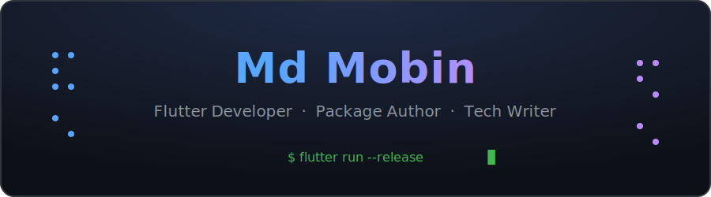

<div align="center">



<br>

[](https://twitter.com/smk_winner)
[](https://www.linkedin.com/in/md-mobin-bb928820b/)
[](https://medium.com/@djsmk123)
[](https://dev.to/djsmk123)
[](mailto:djsmk123@gmail.com)

[](https://smkwinner.vercel.app)
[](./resume.md)
[](https://github.com/djsmk123)

<br>


</div>

```console
$ whoami
Flutter developer adept in all stages of advanced Flutter development —
UI, testing, debugging, and shipping. I build and publish packages,
write about Flutter, gRPC and Go, and occasionally roast resumes.
```

<br>

<h2 align="center">📦 Published Packages</h2>

<table width="100%">
<tr>
<td width="50%" align="center" valign="top">
<h3><a href="https://pub.dev/packages/credential_manager">credential_manager</a></h3>
<a href="https://pub.dev/packages/credential_manager"></a>
<a href="https://pub.dev/packages/credential_manager/score"></a>
<a href="https://pub.dev/packages/credential_manager/score"></a>
<br><a href="https://github.com/Djsmk123/flutter_credential_manager_compose"></a>
<p>Hassle-free login for Flutter — Jetpack Credential Manager on Android, Keychain on iOS.<br>Passkeys, passwords and federated sign-in behind one API.</p>
</td>
<td width="50%" align="center" valign="top">
<h3><a href="https://pub.dev/packages/waveform_fft">waveform_fft</a></h3>
<a href="https://pub.dev/packages/waveform_fft"></a>
<a href="https://pub.dev/packages/waveform_fft/score"></a>
<a href="https://pub.dev/packages/waveform_fft/score"></a>
<br><a href="https://github.com/Djsmk123/waveform_fft"></a>
<p>Real-time audio visualization for Flutter —<br>microphone capture piped through FFT into live waveforms.</p>
</td>
</tr>
</table>

<h2 align="center">🚀 Featured Projects</h2>

<table width="100%">
<tr>
<td width="50%" align="center">
<a href="https://github.com/Djsmk123/Wtf-is-grpc"></a>
</td>
<td width="50%" align="center">
<a href="https://github.com/Djsmk123/Flutter_Resources"></a>
</td>
</tr>
<tr>
<td width="50%" align="center">
<a href="https://github.com/Djsmk123/firebase_app_distribution_example"></a>
</td>
<td width="50%" align="center">
<a href="https://github.com/Djsmk123/roast-my-resume"></a>
</td>
</tr>
</table>

<details>
<summary><b>➕ More projects</b></summary>
<br>
<table width="100%">
<tr><th align="left">Project</th><th align="left">What it is</th><th>⭐</th></tr>
<tr><td><a href="https://github.com/Djsmk123/dart_json_annotations">dart_json_annotations</a></td><td>High-performance Dart JSON serialization codegen, powered by Rust</td><td align="center">3</td></tr>
<tr><td><a href="https://github.com/Djsmk123/passkey_example_flutter">passkey_example_flutter</a></td><td>Passkeys in Flutter with full server-side implementation</td><td align="center">2</td></tr>
<tr><td><a href="https://github.com/Djsmk123/flutter_pagination">flutter_pagination</a></td><td>Flutter pagination using Bloc</td><td align="center">3</td></tr>
<tr><td><a href="https://github.com/Djsmk123/todo_app_hydrated_bloc">todo_app_hydrated_bloc</a></td><td>Todo example for the HydratedBloc blog post</td><td align="center">3</td></tr>
<tr><td><a href="https://github.com/Djsmk123/flutter_deeplinking_example">flutter_deeplinking_example</a></td><td>Deep links with & without Firebase Dynamic Links, ft. React</td><td align="center">4</td></tr>
</table>
</details>

<br>

<h2 align="center">✍️ Writing</h2>

<p align="center">I write about Flutter internals, auth, gRPC and Go.</p>

<p align="center">
<a href="https://github.com/Djsmk123/Wtf-is-grpc"><b>Wtf is gRPC?</b></a> — series on gRPC with Flutter & Golang<br>
More on <a href="https://medium.com/@djsmk123"><b>Medium</b></a> and <a href="https://dev.to/djsmk123"><b>Dev.to</b></a>
</p>

<br>

<h2 align="center">🔤 Top Languages</h2>

<details open>
<summary><b>Hand-drawn, one dash at a time</b></summary>

```text
|\                       /-------------------\      /-------------/\
| \------\               |                   |      |            /  \
|  \      \------\       |     |     ----    |      |           /    \
|   >   Dart      >      |     |    |        |      |           \    /
|  /      /------/       |     |     ---     |      |            \  /
| /------/               |     |        |    |      \-------------\/
|/                       |  ---/    ----     |
                         \-------------------/

        Dart                   JavaScript                 Kotlin

  /------\                            /-----\       /-----\             /-------\
 /        \      |         |         /       \     /       \           |  o      |
|              --|--     --|--      |             |         |        /-/         |
|                |         |        |    ---\     |         |       |    /-------/
 \        /                          \       \     \       /        |   |
  \------/                            \-----/       \-----/         |    \-------\
                                                                     \-\         |
                                                                       |      o  |
                                                                        \-------/

             C++                                Go                      Python
```

```console
$ gh repos --group-by=primary-language

 Dart         ------------------------------------------------------  54
 JavaScript   -----------                                             11
 C++          ---------                                                9
 Kotlin       -------                                                  7
 TypeScript   ---                                                      3
 Python       ---                                                      3
 Java         --                                                       2
 Go           --                                                       2
```

</details>

<details>
<summary><b>⣿ Self-portrait, drawn in braille dots</b></summary>

```text


⠀⠀⠀⠀⠀⠀⠀⠀⠀⠀⠀⠀⠀⠀⠀⠀⠀⠀⠀⢀⢄⢄⢔⢄⢄⢄⢀
⠀⠀⠀⠀⠀⠀⠀⠀⠀⠀⠀⠀⠀⠀⠀⠀⠀⡀⡦⡳⠹⠑⠁⠁⠃⠈⠐⠕⠕⠠⡀
⠀⠀⠀⠀⠀⠀⠀⠀⠀⠀⠀⠀⠀⠀⠀⢀⢰⢕⠅⠀⠀⠀⢀⢀⣀⢄⢄⢀⢀⠈
⠀⠀⠀⠀⠀⠀⠀⠀⠀⠀⠀⠀⠀⠀⠀⡢⣳⠁⠀⠀⢠⣼⣾⣿⣟⣿⡯⣟⡾⣜⡄⡀
⠀⠀⠀⠀⠀⠀⠀⠀⠀⠀⠀⠀⠀⠀⠀⢪⢪⡣⡁⢠⣿⣿⣿⣿⣿⣿⡽⣯⣻⣪⢺⢸⢐⢄
⠀⠀⠀⠀⠀⠀⠀⠀⠀⠀⠀⠀⠀⠀⠀⠐⠑⠱⢱⢜⣿⣿⣿⣿⣿⣷⣟⣗⡧⣳⢕⣇⢇⢇⣇
⠀⠀⠀⠀⠀⠀⠀⠀⠀⠀⠀⠀⠀⠀⠀⠀⠀⢀⠐⢽⣽⣿⣿⣿⢻⠺⠫⠣⠋⢎⢗⠑⠁⠑⠕
⠀⠀⠀⠀⠀⠀⠀⠀⠀⠀⠀⠀⠀⠀⠀⠀⠀⠐⠁⢵⣿⣿⣿⢺⡑⡀⠀⢐⣼⣆⡀⠀⠀⠀⢠
⠀⠀⠀⠀⠀⠀⠀⠀⠀⠀⠀⠀⠀⠀⠀⢀⣞⣶⣼⢸⣿⣿⣷⣿⣽⣱⣠⣾⣿⣿⣶⠀⠀⠐⢜
⠀⠀⠀⠀⠀⠀⠀⠀⠀⠀⠀⠀⠀⠀⠀⢘⣾⢟⣿⣽⣿⣿⣿⣿⣿⡾⣟⣾⡿⠿⡏⠧⡀⢐⢜⠄
⠀⠀⠀⠀⠀⠀⠀⠀⠀⠀⠀⠀⠀⠀⠀⠀⢿⣷⣿⣷⢿⣿⢿⣿⣯⣿⣳⣿⡵⣎⢉⠀⢀⢐⣝⠂
⠀⠀⠀⠀⠀⠀⠀⠀⠀⠀⠀⠀⠀⠀⠀⠀⠈⠻⠻⣻⣿⣿⣿⣷⣿⡿⠝⡗⣏⣃⠃⠀⠂⠱⡕
⠀⠀⠀⠀⠀⠀⠀⠀⠀⠀⠀⠀⠀⠀⠀⠀⠀⠀⠀⢽⣟⣯⣿⣯⡿⣞⣵⣟⡟⡊⠑⠈⢄⢌⠇
⠀⠀⠀⠀⠀⠀⠀⠀⠀⠀⠀⠀⠀⠀⠀⠀⠀⠀⠀⢸⣽⢽⣺⢯⣟⢿⣺⡷⣟⢗⢅⠀⢇⠇
⠀⠀⠀⠀⠀⠀⠀⠀⠀⠀⠀⠀⠀⠀⠀⠀⠀⠀⠀⢐⣿⣷⢧⣣⢣⢳⣷⢑⣵⣟⢟⠆⠦
⠀⠀⠀⠀⠀⠀⠀⠀⠀⠀⠀⠀⠀⠀⠀⠀⠀⠀⠀⢐⣿⣿⣿⢾⣳⣳⣿⣿⣷⢵⢕⢴⢔⡕
⠀⠀⠀⠀⠀⠀⠀⠀⠀⠀⠀⠀⠀⠀⠀⠀⣀⢔⣜⢿⣿⣿⡿⣿⣟⣿⣿⣿⣿⣷⣿⢮⡺⡜⡄
⠀⠀⠀⠀⠀⠀⠀⠀⠀⠀⠀⣀⢠⠤⡲⣹⢸⢱⢪⢣⡫⡻⢿⢿⣽⣿⣿⣿⣿⣯⣿⣿⡳⠹⡪⡂
⠀⠀⠀⠀⠀⢀⡠⣔⢖⢵⢝⡜⣜⢕⢝⢜⢵⡹⡸⡜⡜⡜⡜⡔⣿⣿⣿⣿⣿⣿⣻⡝⢂⠄⠈
⠀⠀⠀⠀⡰⣪⡚⡮⡝⡎⡇⡧⡣⣳⢁⢣⢳⢱⡣⡣⡫⡪⡪⣪⣿⣿⣿⣿⣿⣽⡳⡑
⠀⠀⠀⢰⢝⢮⢺⢸⢸⠪⡎⠪⡪⡪⡣⠐⢕⢇⢗⢕⠡⢫⣪⣿⣿⣿⣿⣻⡺⡪⠃⡠⠀⠐⠄⠀⠀⠀⠀⠀⠀⠀⠀⠀⠀⠀⠀⠀⠀⠀⡀
⠀⠀⠀⢽⡹⣪⡣⡳⡱⡱⡩⡢⠘⠌⡽⡀⢕⢕⢕⢕⡅⡧⣫⢻⢿⣿⠳⠁⠀⡀⢔⠜⠀⡸⠀⠀⠀⠀⠀⠀⠀⠀⠀⠀⠀⠀⠀⠀⠀⠀⢀
⠀⠀⠨⡳⡝⣎⢮⡪⡪⡪⡊⠪⡀⠨⢪⢆⠣⡣⡣⣣⢫⡪⡎⡎⠎⠈⠀⠀⡪⡪⢂⠕⠀⢌
⠀⠀⢨⡫⡞⣎⢮⢪⡡⡃⡣⠠⠨⠀⠡⡣⢁⢇⢧⢳⢱⢱⠑⠁⠀⠀⠀⠀⡪⡪⡢⠃
⠀⠀⢐⣝⢞⣜⢎⣇⢏⡎⣎⢖⠄⠀⠈⢜⢜⢵⢝⢜⡜⡜⠀⠀⠀⠀⠀⠀⠜⡜⠔
⠀⠀⠠⡳⣝⢼⢕⣕⢧⢫⢪⠪⡊⠀⢀⡰⡝⡌⠎⡎⠊⠀⠀⠀⠀⠀⠀⠀⠈⡪⠂
⠀⠀⠀⢯⢮⡳⡣⡧⡳⡱⡱⡱⡡⡢⡇⡗⡝⡜⠀⠀⠀⠀⠀⠀⠀⠐⠀⠀⠀⠀⠀⠀⠀⠀⠀⠀⠀⠀⠀⠀⠀⠀⠀⠀⠀⠀⠀⠀⠀⠀⠀⠨
⠀⠀⠀⡳⣳⡹⡕⡧⡳⡩⡪⣪⢺⢸⢱⢹⢘⠈⡀
⠀⠀⠀⢝⢮⢎⡗⢕⡱⡣⡇⡇⡗⠕⢕⠕⠁⠀⡂
⠀⠀⠀⠵⡝⢊⢜⢼⢸⡱⢕⠕⡍⠆⠑⠀⠀⢐⠄
⠀⠀⠀⢘⢢⠱⠨⡪⡢⡣⡃⠈⡪⠀⠀⠀⠀⠂⠁⠀⠀⠀⠀⠀⠀⠀⠀⠀⠀⠀⠀⠀⠀⠀⠀⠀⠀⠀⠀⠀⠀⡀⡀
⠀⠀⠀⠐⠇⢘⠈⢎⡂⢘⠄⠀⠂⠀⠀⠀⠀⠀⠀⠀⠀⠀⠀⠀⠀⠀⠀⠀⠀⠀⠀⠀⠀⠀⠀⠀⠀⠀⠐⢌⢪⠀⠁⠁
⠀⠀⠀⠀⠡⢐⢅⠱⣐⠀⡂⠀⠀⠀⠀⠀⠀⠀⠀⠀⠀⠀⠀⠀⠀⠀⠀⠀⠀⠀⠀⠀⠀⠀⠠⡀⠐⠄⠈⠀⠐⠁
⠀⠀⠀⠀⠀⠑⡕⡌⢖⠀⠀⠀⠀⠀⠀⠀⠀⠀⠀⠀⠀⠀⠀⠀⠀⠀⠀⠀⠀⠀⠀⠀⠀⠀⠈⠐
⠀⠀⠀⠀⠀⠀⣱⡑⠁
⠀⠀⠀⠀⠀⠀⡽⣗⢦⣀
⠀⠀⠀⠀⠀⠀⠙⣵⢿⣹⡯⡗⡄
⠀⠀⠀⠀⠀⠀⠈⠙⢴⢯⠋⠈
⠀⠀⠀⠀⠀⠀⠀⠀⠨⣂
⠀⠀⠀⠀⠀⠀⠀⠀⡜⡔⡁
⠀⠀⠀⠀⠀⠀⠀⢘⢜⡜⡜⢔⢄⢄⢄⢆⢆
⠀⠀⠀⠀⠀⠀⠀⠀⠈⢈⠊⢎⢊⢀⠁
⠀⠀⠀⠀⠀⠀⠀⠀⡠⠃⠁⡀⡈⠂⠇⠕⢔⢄⢀
⠀⠀⠀⠀⠀⠀⠀⢔⢕⢆⢏⡪⡪⡠⡀⠀⠀⠀⠑⠅⠃⠐⠄⠔
⠀⠀⠀⠀⠀⠀⠀⠀⡑⡕⠕⠕⢕⢕⢕⢕⢕⢔⢄⠢
⠀⠀⠀⠀⠀⠀⠀⠀⡪⡪⢢⠂⠄⡀⠀⠀⠁⠈
⠀⠀⠀⠀⠀⠀⠀⢐⢕⢕⠔⡕⡰⢠⢀
⠀⠀⠀⠀⠀⠀⠀⠐⠕⠅⡇⠕⠜⠌⠂⠇⠕⡰⠠⢀⢀
⠀⠀⠀⠀⠀⠀⠀⢨⠊⠜⢐⠄⢄
⠀⠀⠀⠀⠀⠀⠀⠐⠠⠂⠑⠑⠑
⠀⠀⠀⠀⠀⠀⠠⡠⡠⠢⠂
⠀⠀⠀⠀⠀⠀⢐⢔⢄
⠀⠀⠀⠀⠀⠀⢐⠱
⠀⠀⠀⠀⠀⠀⢐⠑
```

<sub>Made with my <a href="https://github.com/Djsmk123/image-to-dot-text">image → dot text</a> converter: grayscale → autocontrast → gamma → Floyd–Steinberg dither → 2×4 braille cells.</sub>

</details>

<br>

<h2 align="center">📊 GitHub Stats</h2>

<div align="center">

<picture>
  <source media="(prefers-color-scheme: dark)" srcset="https://github-readme-stats.vercel.app/api?username=djsmk123&count_private=true&theme=github_dark&show_icons=true">
  
</picture>
<picture>
  <source media="(prefers-color-scheme: dark)" srcset="https://github-readme-stats.vercel.app/api/top-langs/?username=djsmk123&theme=github_dark&layout=compact">
  
</picture>

</div>

<br>

<div align="center">

📫 Reach me at <a href="mailto:djsmk123@gmail.com"><b>djsmk123@gmail.com</b></a> — always up for talking Flutter, auth and gRPC.

<sub>Press <kbd>.</kbd> on any of my repos to open it in github.dev</sub>

</div>
